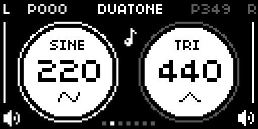

# Duatone



Duatone is a two-channel tone generator for norns built around phase, stereo placement, and simple waveform control.

## Installation

Requires: norns

Install via Maiden or clone/download this repo to:

```sh
/home/we/dust/code/duatone
```

Restart norns after install so SuperCollider picks up `Engine_Duatone.sc`.

## Features

- Two independent tone channels with per-side waveform, frequency, phase, volume, and play state
- Waveforms: `sine`, `square`, `triangle`, `saw`
- Per-side phase modulation with adjustable rate and span bounds
- Shared phase sweep modes: `WRAP` and `PING-PONG`
- Seven presets for exploring stereo phase and frequency relationships
- Active-channel emphasis for quick editing

## Controls

- `E1`: step presets and recall immediately
- `E2`: fine frequency for the selected side
- `E3`: cycle waveform for the selected side
- tap `K2`: switch selected side (`L` / `R`)
- hold `K2` + `E2`: coarse frequency for the selected side
- hold `K2` + `E3`: adjust volume for the selected side
- tap `K3`: toggle phase modulation for the selected side
- hold `K3` + `E2`: turn phase modulation off and set a static phase for the selected side

## Parameters

- Levels: `L volume`, `R volume`, `global volume`
- Modulation: `phase sweep`, `L mod rate`, `R mod rate`
- Modulation spans: `L mod span min`, `L mod span max`, `R mod span min`, `R mod span max`
- Stereo placement: `L pan`, `R pan`

Set both pan controls to `0` for dual-mono output.

## Presets

Presets recall waveform, frequency, and phase relationships for both sides, while volume and play state remain available as performance controls.

- `OVAL`
- `FIGURE8`
- `TREFOIL`
- `TRIKNOT`
- `ORBIT`
- `DRIFT`
- `ROSETTE`
